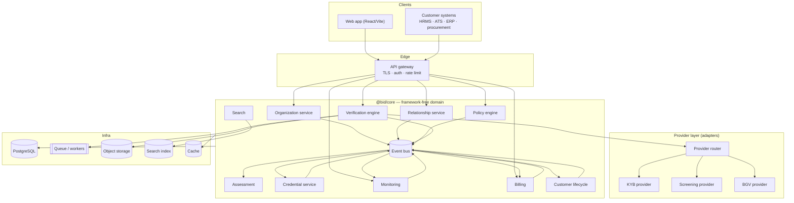
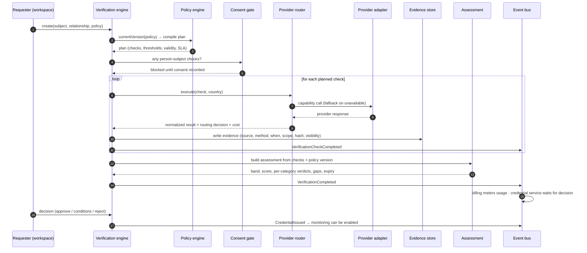
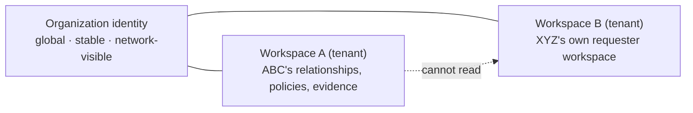

# Architecture

BID Trust is a trust-infrastructure layer, not a vertical application. The
architecture exists to keep three things true as the product grows:

1. **The engine never changes per industry** — only policy does.
2. **The core never knows which provider ran a check** — only capabilities.
3. **Being in the network is never a reason to see someone's data** — tenancy
   and classification are enforced on every operation.

---

## 1. Layers



The domain package has **no dependency on HTTP, React, or a database driver**.
That is what lets the identical engine run in the browser demo, in the API
process, and in tests, and it is what makes the storage swap (in-memory →
Prisma/PostgreSQL) a repository change rather than a rewrite.

---

## 2. Request path: one verification



Two properties matter here:

- The **plan is compiled once** from the policy version in force at request
  time, and that version is then sealed. A later policy edit cannot retroactively
  change what was run or what justified a decision.
- **Billing is a consumer, not a caller.** The verification engine publishes
  events; the billing service meters them. The engine contains no pricing logic.

---

## 3. Event-driven interior

Services communicate through domain events rather than direct calls for side
effects (ADR-012):

| Event | Consumers |
| --- | --- |
| `VerificationCheckCompleted` | Billing (usage metering) |
| `VerificationCompleted` | Campaign progress, customer lifecycle, notifications |
| `OrganizationClaimed` / `OrganizationVerified` | Customer lifecycle |
| `InvitationCreated` / `InvitationAccepted` | Customer lifecycle, notifications |
| `SubscriptionCreated` | Organization commercial state, lifecycle, entitlements |
| `MonitoringEnabled` | Subscription monitored-entity count, lifecycle signals |
| `CredentialIssued` / `CredentialRevoked` | Profile projection, notifications |

The bus is in-memory (`InMemoryEventBus`) with a broker-shaped interface —
`publish` / `subscribe` / envelope carrying id, timestamp, tenant scope and
correlation id — so NATS, Kafka or SQS can replace it without touching business
logic. The live event stream is visible at `/app/audit` → *Event stream*.

---

## 4. Tenancy



- `organization_id` is the global identity.
- `workspace_id` (with its `tenant_id`) is the private boundary.
- Every tenant-owned record carries `workspaceId`, and every read/write passes an
  `AccessContext`.
- Search runs through the same guard as direct reads, so a result set can never
  become a side channel.

An organization participating in someone else's workspace (as a verification
subject) sees the outcome of checks that concern it, not the requester's other
relationships, policies or assessments.

---

## 5. Package structure

```
packages/core/src
├── domain/          enums, entity types, check catalog
├── policy/          templates, plan compiler, policy generator
├── providers/       capability interfaces, mock adapters, router
├── verification/    assessment (explainability, freshness, bands)
├── services/        organization, relationship, policy, verification,
│                    campaign, monitoring, billing, lifecycle, search
├── security/        AccessContext, RBAC+ABAC, visibility, redaction
├── billing/         plan catalog and price book (configuration)
├── events/          event names, envelope, in-memory bus
├── store/           repository abstraction + in-memory implementation
├── seed/            the fictional demo network
└── platform.ts      composition root + high-level journeys + graph projection
```

`platform.ts` is the only place that wires services together, subscribes event
consumers, and exposes composed journeys (`inviteCounterparty`,
`acceptInvitation`, `runVerification`, `activateRequester`). Both the web app and
the API call those; neither reimplements a workflow.

---

## 6. Frontend architecture

- **React 18 + TypeScript + Vite**, Tailwind for the design system,
  `@xyflow/react` for the network graph and the architecture explorer,
  Framer Motion for transitions, Recharts for analytics, Lucide for icons.
- `PlatformProvider` owns one `BidPlatform` instance, exposes the current
  session (`organizationId`, derived `AccessContext`, entitlements), and
  re-renders on domain events plus explicit mutations.
- Pages are thin: they call domain services and render. Business rules —
  what a member may do, what evidence is visible, how a score is explained —
  live in `@bid/core` and are therefore identical in the API.
- Every capability the current organization lacks renders as a **locked**
  affordance that explains *why* (role vs plan), rather than disappearing.

---

## 7. Deployment shape

Cloud-neutral by construction. Nothing in the business architecture assumes AWS,
Azure or GCP:

| Concern | Abstraction | Production candidate |
| --- | --- | --- |
| Persistence | Repository interface | PostgreSQL (schema in `prisma/`) |
| Queue | Job interface | BullMQ / SQS / Cloud Tasks |
| Object storage | Storage interface | S3-compatible |
| Search | Index interface | OpenSearch / Elasticsearch |
| Events | `EventBus` | NATS / Kafka / SQS |
| Cache | Cache interface | Redis |
| Secrets | Secret reference on provider records | Vault / cloud secret manager |
| Identity | OIDC-ready auth boundary | Any OIDC provider |

`docker-compose.yml` runs the API, the built web app behind a static server, and
PostgreSQL for the target schema.

---

## 8. Where the architecture is deliberately simple today

| Area | Today | Production |
| --- | --- | --- |
| Store | In-memory repositories | Prisma + PostgreSQL, row-level security |
| Providers | Three deterministic mocks, no network calls | Real adapters behind the same interfaces |
| Event bus | In-process | Broker with retries and dead-lettering |
| Check execution | Synchronous loop | Queue workers, partial results, retries |
| Audit hash | Fast non-cryptographic hash | SHA-256 with signing key, WORM retention |
| Auth | Demo session + demo API key | OIDC sessions, hashed workspace keys, SSO |

Each of these is isolated behind an interface, which is the point: they can be
replaced without disturbing the domain. See
[`ASSUMPTIONS.md`](ASSUMPTIONS.md) for the complete list.
