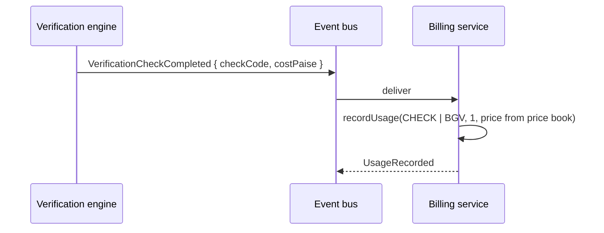

# Billing & revenue model

> **Illustrative starting prices; final pricing depends on verification scope,
> provider costs, volume, SLA and requirements.**

That disclaimer is not decoration: prices are configuration, editable at runtime
from the admin console (`/admin` → *Plans & pricing*), and no domain code path
reads a hard-coded price.

---

## 1. Revenue streams

1. SaaS subscription
2. Verification usage (per check)
3. Re-verification
4. Monitoring (per monitored entity per month)
5. Background verification (BGV)
6. Employee verification
7. Contractor verification
8. API usage
9. Enterprise integrations
10. Enhanced due diligence

Streams 2–10 are metered by the billing service **in response to domain events**.
The verification engine never mentions money.

---

## 2. Plans

| Plan | Illustrative price | Included checks | Key entitlements |
| --- | --- | --- | --- |
| BID Member | Free | — | Profile, respond to requests, credentials, BID ID, digital card |
| Starter | ₹9,999 / month | 100 | Initiate verification, campaigns, basic monitoring (25), 5 seats |
| Growth | ₹24,999 / month | 500 | + custom policies, BGV, API, webhooks, monitoring (100), 15 seats |
| Business | ₹49,999 / month | 1,200 | + enterprise integrations, dual control, monitoring (400), 40 seats |
| Enterprise | from ₹1,00,000 / month | custom | + SSO, provider routing preferences, dedicated SLAs, audit exports |

Usage price book (also configurable):

| Item | Illustrative starting price |
| --- | --- |
| Business verification | ₹499 / check |
| BGV | ₹499 / check or package |
| Enhanced due diligence | ₹999+ |
| Re-verification | ₹299 |
| Monitoring | ₹99 / entity / month |
| API call | ₹0.20 |

---

## 3. Entitlements are the authorization surface

```ts
Entitlements {
  canInitiateVerification, canCreateCampaigns, canCreatePolicies,
  canRunBgv, canUseMonitoring, canUseApi, canUseWebhooks,
  canUseEnterpriseIntegrations,
  maxSeats, maxMonitoredEntities, includedChecksPerMonth,
}
```

Permission checks read **entitlements**, never plan names or commercial state.
A workspace with no subscription resolves to the free member set, which is why
"member ≠ customer" cannot drift: there is no branch anywhere that says
`if (plan === 'GROWTH')`.

```ts
// packages/core/src/security/access.ts
const ENTITLEMENT_GATES = {
  'verification:initiate': 'canInitiateVerification',
  'campaign:write':        'canCreateCampaigns',
  'policy:write':          'canCreatePolicies',
  'monitoring:write':      'canUseMonitoring',
};
```

---

## 4. Metering



Metrics: `CHECK`, `BGV`, `REVERIFICATION`, `ENHANCED_DD`, `MONITORING`,
`API_CALL`. Each record carries workspace, period (`YYYY-MM`), quantity, amount
and a reference back to the verification that caused it.

Provider cost is captured separately on the provider transaction, so unit
economics per check (customer price vs provider cost) are computable without
mixing the two.

---

## 5. Credits

Prepaid check credits sit in a per-workspace wallet with a ledger. Subscribing
grants the plan's included volume as credits; the ledger records every movement
with a reason and reference. Credits are visible in the product
(`/app/billing`) and to BID staff in the admin console.

---

## 6. Usage summary and invoicing

`BillingService.summary(workspaceId, period)` returns:

```ts
{ period, includedChecks, usedChecks, overageChecks,
  monitoringEntities, apiCalls, bgvChecks,
  subscriptionPaise, overagePaise, monitoringPaise, totalPaise, creditBalance }
```

An invoice is composed of line items — subscription, overage checks, monitoring —
plus tax, with statuses `DRAFT → ISSUED → PAID | OVERDUE | VOID`. Payments are
recorded against invoices and publish `PaymentReceived`.

Example (ABC Technologies, Business plan, seeded demo):

| Line | Qty | Unit | Amount |
| --- | --- | --- | --- |
| Business subscription | 1 | ₹49,999 | ₹49,999 |
| Continuous monitoring | 1 entity | ₹99 | ₹99 |
| **Total (excl. tax)** | | | **₹50,098** |

---

## 7. Commercial state transitions

| Trigger | Effect |
| --- | --- |
| Organization claims its identity | `NON_MEMBER → MEMBER`, free entitlements |
| Verification approved by a counterparty | `MEMBER → VERIFIED_MEMBER` (**still free**) |
| Requester activation begins | `VERIFIED_MEMBER → REQUESTER` |
| Subscription created | `REQUESTER → CUSTOMER` (or `ENTERPRISE`), entitlements switch on, `PAID_CUSTOMER` in the customer lifecycle |
| Subscription cancelled | Workspace reverts to free member capabilities; identity and existing credentials are untouched |

Cancelling never removes a credential the organization earned. Trust already
established is not a hostage to a subscription.

---

## 8. Revenue analytics

The admin console derives, from live records rather than fixtures:

MRR, ARR, revenue mix by stream, average revenue per customer, paying customers
vs free members, expansion revenue, churned revenue, and net revenue retention:

```
NRR = (subscription + expansion − churned) / subscription × 100
```

Trend series in the demo are clearly labelled *illustrative*; the point totals
are computed from the seeded network.

---

## 9. What production adds

- Payment gateway integration, dunning and retries
- Tax configuration per jurisdiction
- Proration on mid-cycle plan changes
- Hard budget caps and real-time spend alerts
- Enterprise contract terms (committed volume, custom rates, provider
  cost pass-through transparency)
- Revenue recognition exports
