# Customer lifecycle & the acquisition flywheel

BID's acquisition model is structural, not a growth tactic: the product's own
usage introduces the next cohort of customers.

---

## 1. The flywheel

```mermaid
flowchart LR
  ABC["ABC — paying customer"] -->|invites| XYZ["XYZ — invited"]
  XYZ -->|claims identity| M["BID Member (free)"]
  M -->|verified by ABC| VM["Verified member + credential"]
  VM -->|discovers value| D[Discovery]
  D -->|activates| R[Requester]
  R -->|subscribes| C["Paying customer"]
  C -->|invites| LMN["LMN — invited"]
  LMN --> M2["BID Member (free)"]
  M2 --> VM2[Verified member]
  VM2 --> D2[…]
```



The first invitee must **not** become a paying customer automatically. It becomes
a member, gets verified, receives something it can reuse, and only then is shown
the requester proposition. That sequence is the product.

---

## 2. States

```
UNKNOWN → INVITED → REGISTERED → BID_MEMBER → VERIFICATION_IN_PROGRESS →
VERIFIED_MEMBER → DISCOVERY → REQUESTER_ACTIVATION → FIRST_VERIFICATION →
PAID_CUSTOMER → ACTIVE → EXPANDING → ENTERPRISE → NETWORK_PARTICIPANT
```

Negative states: `LOW_USAGE · AT_RISK · DORMANT · CHURNED · WIN_BACK`.

Transitions are driven by domain events, not by manual tagging:

| Event | Transition |
| --- | --- |
| `InvitationCreated` | → `INVITED` |
| `InvitationAccepted` | → `REGISTERED` |
| `OrganizationClaimed` | → `BID_MEMBER` |
| `OrganizationVerified` | → `VERIFIED_MEMBER` |
| requester activation started | → `REQUESTER_ACTIVATION` |
| `VerificationCompleted` (first as requester) | → `FIRST_VERIFICATION` |
| `SubscriptionCreated` | → `PAID_CUSTOMER` |
| usage growth / seat and monitoring expansion | → `EXPANDING` |
| health decay | → `LOW_USAGE` → `AT_RISK` → `DORMANT` → `CHURNED` |

**This is not the organization lifecycle.** An organization can be `VERIFIED`
(identity) while its customer state is `BID_MEMBER` (commerce) — which is exactly
the case for XYZ HR Consultants in the demo.

---

## 3. Health scoring

```
base 50
+ min(20, verifications in last 30d × 2)
+ min(10, monitored entities / 5)
+ min(10, features adopted × 2)
+ min(5,  policies created × 2)
+ 5 if API used in last 30d
− 3 per open support case
− 20 if in a negative lifecycle state
− 10 if zero verifications in 30d
```

Tracked signals: login recency, verification volume, API usage, monitoring usage,
credit consumption, policy authoring, subscription and payment state, support
load, feature adoption.

The admin console renders these as a lifecycle board with per-account health,
owner and last-activity — BID's own customer-success engine.

---

## 4. The funnel

Computed live from the store, not from fixtures:

| Stage | Definition |
| --- | --- |
| Invited | Organizations past `DISCOVERED` |
| Registered | Identity claimed |
| BID Member | Commercial state beyond `NON_MEMBER` |
| Verified member | Holds an approved verification |
| Requester | Requester capabilities activated |
| First verification | Requesters that have run at least one |
| Paid customer | Active subscription |
| Expansion | `EXPANDING` or `ENTERPRISE` |

Conversion between consecutive stages is displayed in the admin overview. The
interesting ratios for this business are **member → verified member** (does
verification actually complete?) and **verified member → requester** (does the
flywheel turn?).

---

## 5. Instrumenting the flywheel

Attribution is in the model: `Organization.introducedByOrgId` records who brought
each organization into the network, so cohorts can be traced back to the customer
that generated them. In the demo, ABC introduced XYZ, LMN, RST and OPQ; JKL
introduced GHI — two hubs rather than a star.

---

## 6. Intervention points

| Signal | Play |
| --- | --- |
| Verified member, no requester activity for 14 days | Show the "verify your own network" proposition in-product |
| Requester activated, no first verification in 7 days | Offer a policy template and a pre-filled campaign |
| Usage below 30% of included volume for two periods | Right-size the plan before renewal instead of after churn |
| Verification exceptions rising | Compliance review — is the policy wrong, or the counterparty? |
| Monitoring alerts unacknowledged | Alert fatigue; tune signals and cadence |
| Open support cases + falling usage | `AT_RISK`; assign an owner |

---

## 7. Where this lives in the product

- `/app` — role-aware dashboard; the "become a requester" proposition appears
  only for members
- `/app/become-requester` — the activation flow (what to verify → industry →
  risk → plan), which generates a starting policy on activation
- `/app/journey` — the 14-step golden path, performing every transition for real
- `/admin` → *Customer lifecycle* — the board, health scores and support cases
- `/admin` → *Overview* — the funnel with conversion rates
- `/admin` → *Revenue* — MRR/ARR, mix, ARPC, NRR
