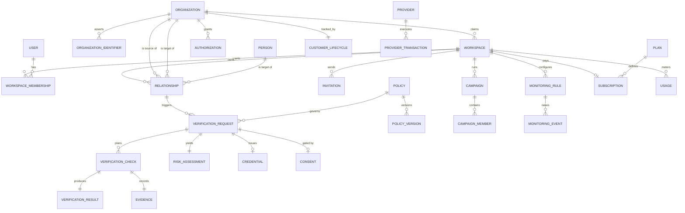
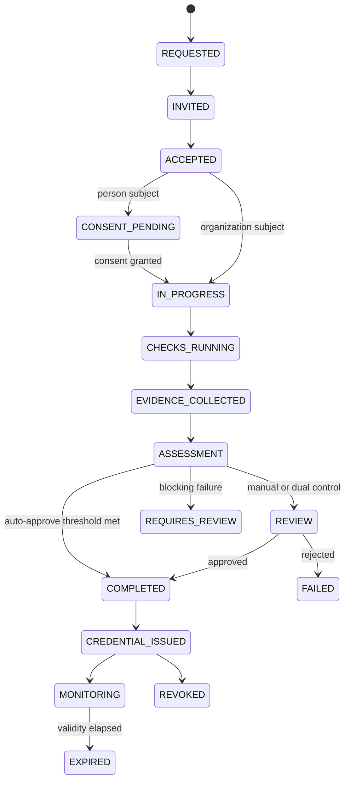

# Domain model

The model is deliberately built around one primary entity and four independent
lifecycles. Collapsing any two of them is the mistake this document exists to
prevent.

---

## 1. Entity map



---

## 2. The primary entity

**Organization.** Not a vendor, not a supplier, not a customer — those are
relationship- and commerce-scoped facts about an organization, not types of
organization (ADR-001).

```ts
Organization {
  id, bidId,                    // BID-BUS-00231 — private-platform identifier
  legalName, displayName, industry, country, city, website, description,
  lifecycle,                    // identity state
  commercialState,              // relationship with BID
  primaryWorkspaceId?,          // the tenant it operates from, once claimed
  introducedByOrgId?,           // who brought it into the network (flywheel edge)
}
```

**Person** exists as a first-class subject for BGV, but is never network-visible:
a person record is reachable only from the workspace that ran the verification,
under a recorded consent.

**Workspace** is the tenant. `organization_id ≠ workspace_id` (ADR-011): the
identity is global and permanent; the workspace is private and can be one of
several an organization operates.

---

## 3. Relationship as a first-class object

```ts
Relationship {
  id, bidId, workspaceId,               // owned by the source's tenant
  sourceOrganizationId,
  targetType, targetOrganizationId | targetPersonId,
  type,                                 // VENDOR | SUPPLIER | CONTRACTOR | …
  startDate, endDate,
  lifecycle,                            // DISCOVERED → … → ARCHIVED
  riskLevel, criticality,
  policyId, latestVerificationId, verificationStatus,
  contractReference, monitoringEnabled,
}
```

The same organization participates in thousands of relationships, in different
directions, with different policies and different verification states. ABC's
relationship record with XYZ lives in ABC's workspace; XYZ sees that it was
asked to verify, not ABC's copy of the relationship.

---

## 4. Four lifecycles

They are separate concepts with separate transitions, separate audit trails and
separate analytics (ADR-003).

### Organization lifecycle (identity)
`DISCOVERED → INVITED → CLAIMED → REGISTERED → VERIFIED → ACTIVE → SUSPENDED → ARCHIVED`

An identity can exist before anyone from that organization has ever logged in.
Historical identity and relationship data is retained under a retention policy
rather than deleted.

### Customer lifecycle (commerce with BID)
`UNKNOWN → INVITED → REGISTERED → BID_MEMBER → VERIFICATION_IN_PROGRESS →
VERIFIED_MEMBER → DISCOVERY → REQUESTER_ACTIVATION → FIRST_VERIFICATION →
PAID_CUSTOMER → ACTIVE → EXPANDING → ENTERPRISE → NETWORK_PARTICIPANT`
plus `LOW_USAGE · AT_RISK · DORMANT · CHURNED · WIN_BACK`.

### Relationship lifecycle
`DISCOVERED → INVITED → VERIFICATION → ASSESSMENT → PENDING_APPROVAL → ACTIVE →
MONITORED → SUSPENDED → TERMINATED → ARCHIVED`

### Verification lifecycle
`REQUESTED → INVITED → ACCEPTED → CONSENT → IN_PROGRESS → CHECKS_RUNNING →
EVIDENCE_COLLECTED → ASSESSMENT → REVIEW → COMPLETED → CREDENTIAL_ISSUED →
MONITORING`
with exceptions `FAILED · PARTIAL · EXPIRED · REQUIRES_REVIEW · REVOKED`.



---

## 5. Commercial state vs entitlements

`commercialState` (`NON_MEMBER → MEMBER → VERIFIED_MEMBER → REQUESTER → CUSTOMER
→ ENTERPRISE`) is a *descriptive* fact about the organization.

Authorization never reads it. Authorization reads **entitlements** resolved from
the workspace's subscription:

```ts
Entitlements {
  canInitiateVerification, canCreateCampaigns, canCreatePolicies,
  canRunBgv, canUseMonitoring, canUseApi, canUseWebhooks,
  canUseEnterpriseIntegrations,
  maxSeats, maxMonitoredEntities, includedChecksPerMonth,
}
```

A workspace with no subscription resolves to the free member entitlement set.
This is why "member ≠ customer" survives refactors: there is no code path where
a plan name grants a capability.

---

## 6. Policy and policy version

```ts
Policy         { id, bidId, workspaceId?, name, subjectType, relationshipType,
                 industry, riskLevel, currentVersion, system }
PolicyVersion  { policyId, version, requiredChecks[], optionalChecks[],
                 documents[], thresholds, validityDays, reverificationDays,
                 monitoringFrequency, approvalRule, requiresConsent, sealedAt? }
```

- `workspaceId = null` ⇒ a BID-published template usable by every tenant.
- A version is **sealed** the moment it justifies a completed decision; edits
  create a new version. Old verifications keep pointing at the version that
  produced them (ADR-004).

---

## 7. Evidence and assessment

```ts
Evidence {
  what, source, attribution, providerId, providerName, method,
  checkedAt, result, confidence, scope, reference, payloadHash,
  expiresAt, freshness, policyId, policyVersion, visibility, auditLogId
}
```

Attribution is one of `COMPANY_PROVIDED | BID_VERIFIED | PROVIDER_VERIFIED |
OFFICIAL_SOURCE_DERIVED`, and the UI must always distinguish them.

```ts
Assessment {
  band, score, categories[{category, verdict, passed, total, weight, contribution, notes}],
  missingChecks[], failedChecks[], attentionChecks[],
  freshness, policyId, policyVersion, explanation, disclaimer, expiresAt
}
```

The score is reconstructible: each category contributes `ratio × weight`, and
the explanation names the strongest category, the weakest, the blocking
failures, the gaps and the thresholds applied.

---

## 8. Consent vs authorization (ADR-007)

| | Consent | Authorization |
| --- | --- | --- |
| Who gives it | The subject (usually a person) | An organization |
| What it permits | Processing for a stated purpose and scope | Another organization to perform an operation |
| Fields | subject, purpose, scope, version, status, timestamps, expiry, revocation | grantor, grantee, operation, scope, relationship, window, status, revocation |
| Enforcement | Person-subject checks stay `BLOCKED_ON_CONSENT` until granted | Cross-organization operations check an active grant |

They are separate tables, separate lifecycles and separate revocation paths.
Conflating them is how platforms end up processing personal data on the strength
of a commercial agreement the subject never saw.

---

## 9. Visibility classification

Every field and evidence record carries one of:

`PUBLIC < ORGANIZATION_ONLY < RELATIONSHIP_ONLY < AUTHORIZED_ONLY < SENSITIVE < RESTRICTED`

The viewer's maximum clearance is computed from context:

| Viewer | Maximum |
| --- | --- |
| Anonymous / public route | `PUBLIC` |
| Counterparty in an active relationship | `RELATIONSHIP_ONLY` |
| Holder of a matching authorization | `AUTHORIZED_ONLY` |
| The subject organization itself | `SENSITIVE` |
| The workspace that ran the verification | `RESTRICTED` |

The public profile is built from this classification rather than from a
hand-picked field list, so adding a check cannot accidentally publish it.

---

## 10. Invariants

1. An organization is never intrinsically a vendor, supplier or customer.
2. A relationship always has an owning workspace.
3. A verification always references a policy **version**, never a policy alone.
4. A sealed policy version is immutable.
5. A verification result always references evidence; evidence always names a
   source, a provider, a method and a timestamp.
6. Person-subject checks never execute without an in-scope, unexpired consent.
7. Public projections never contain `SENSITIVE` or `RESTRICTED` material.
8. Commercial state changes only through explicit lifecycle transitions, and
   never as a side effect of being verified.
9. Every state change writes an audit entry that links to the previous one.
10. Deletion is retention-policy driven; identity and relationship history is
    preserved.
